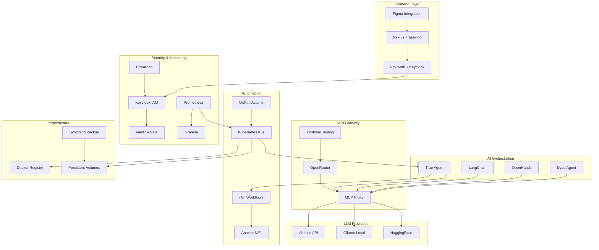

# 🚀 Full-Stack Industrial AI Development Environment

<p align="center">**Uma stack full-stack avançada, econômica e robusta para desenvolvimento, automação e deploy de aplicações baseadas em IA**</p>

<p align="center">
  <a href="#-visão-geral">Visão Geral</a> •
  <a href="#-arquitetura">Arquitetura</a> •
  <a href="#-começando">Começando</a> •
  <a href="#-operação">Operação</a> •
  <a href="#-configurações-avançadas">Avançado</a> •
  <a href="#-contribuição">Contribuição</a>
</p>

<p align="center">
  
  
  
  
  
  
  
  
</p>

## 🌟 Visão Geral

Esta stack full-stack industrial para desenvolvimento de aplicações baseadas em IA combina orquestração de modelos locais e em nuvem, automação de workflows, segurança corporativa e capacidades avançadas como Retrieval Augmented Generation (RAG) para fornecer respostas contextuais precisas. A arquitetura prioriza ferramentas open source e self-hosted, oferecendo controle total sobre a infraestrutura.

### Principais Funcionalidades

- 💻 **Terminal Moderno**: Warp CLI e Starship para alto throughput operacional
- 🤖 **Orquestração Multiagente**: Trae Agent, LangChain (com **LangChain CLI**), Dyad, OpenHands (com **AutoGen CLI**)
- 🧠 **Multi-LLM**: Abacus API (cloud), Ollama (local), HuggingFace (open source), e roteamento inteligente com **LiteLLM Proxy CLI**
- 🔄 **Automação**: n8n workflows, Apache NiFi e pipelines CI/CD com GitLab CI ou GitHub Actions
- 🛡️ **Segurança**: Keycloak (IAM), Vault (secrets), Bitwarden (passwords), e análise de código com **SonarQube Community Edition**
- 📊 **Observabilidade**: Prometheus e Grafana com alertas em tempo real
- 🎨 **Frontend**: Next.js, Tailwind CSS e integração com **Penpot** (open source)
- 🐳 **Containerização**: Docker e Kubernetes com Helm charts
- 💾 **Persistência e Sincronização**: **Syncthing** para backup e sincronização de dados
- 🔍 **Processamento de Linguagem**: **OpenNLP** ou spaCy para NLP avançado e **Lark** para parsing
- 🧠 **RAG (Retrieval Augmented Generation)**: **Qdrant/ChromaDB** para armazenamento vetorial e **LightRAG** para implementação

## 🏗️ Arquitetura

### Diagrama de Arquitetura


## 🚀 Começando
### Pré-requisitos

- Sistema Operacional: Linux (preferencial), macOS ou Windows via WSL
- Ferramentas Base: Docker, Git, Python 3.10+
- Conhecimentos: Conceitos de Kubernetes, linha de comando
- Acesso: Internet para downloads e APIs

### Instalação Rápida
```bash
# Instalar componentes essenciais
bash -c "$(curl -fsSL https://raw.githubusercontent.com/arturdrr/full-stack-industrial-ai/main/scripts/setup.sh)"
```
Para uma instalação manual detalhada, consulte nossa documentação de deployment.

### Configuração Inicial
```bash
# Configurar variáveis de ambiente
export ABACUS_API_KEY="sua-chave-aqui"
export OPENAI_API_KEY="sua-chave-aqui"
export GOOGLE_API_KEY="sua-chave-aqui" # Para Gemini
export ANTHROPIC_API_KEY="sua-chave-aqui" # Para Claude
export PERPLEXITY_API_KEY="sua-chave-aqui" # Para Perplexity
export HUGGINGFACE_API_KEY="sua-chave-aqui"

# Iniciar containers essenciais
docker-compose -f docker-compose.yml up -d
```
## 🛠️ Operação
### Agentes de IA
Os agentes podem ser configurados via arquivo YAML:
```yaml
agents:
  trae_agent:
    model: trae_agent_model
    max_steps: 200
  langchain_agent:
    model: langchain_model
    max_steps: 150
```
### Segurança
Keycloak e Vault formam a base de segurança:
```bash
# Iniciar Keycloak
./scripts/deploy-keycloak.sh

# Iniciar Vault
./scripts/deploy-vault.sh
```
### Monitoramento
Monitoramento com Prometheus e Grafana:

- Prometheus: http://localhost:9090
- Grafana: http://localhost:3000 (admin/admin)

## 💡 Configurações Avançadas
Consulte nossa documentação para configurações avançadas:

- Arquitetura Detalhada
- API e Integrações
- Perguntas Frequentes
- Roadmap

## 🔧 Manutenção
Atualize componentes regularmente:
```bash
# Atualizar Trae Agent
cd trae-agent
git pull origin main
pip install -r requirements.txt --upgrade

# Atualizar containers
docker-compose pull
docker-compose up -d
```
## 🤝 Contribuição
Contribuições são bem-vindas! Por favor, leia nosso guia de contribuição para mais detalhes sobre:

- Processo de fork e pull request
- Padrões de código
- Testes
- Documentação

## 📄 Licença
Este projeto está licenciado sob a Licença MIT - veja o arquivo LICENSE para detalhes.

## 📚 Links Úteis

### Documentação
- [Trae Agent](https://github.com/bytedance/trae-agent)
- [LangChain](https://python.langchain.com/docs/)
- [Keycloak](https://www.keycloak.org/guides)
- [Vault](https://developer.hashicorp.com/vault/docs)
- [LiteLLM Proxy CLI](https://github.com/BerriAI/litellm)
- [AutoGen CLI](https://microsoft.github.io/autogen/)
- [ChromaDB](https://docs.trychroma.com/)
- [Qdrant](https://qdrant.tech/documentation/)
- [LightRAG](https://github.com/lightrag/lightrag)
- [SonarQube CE](https://docs.sonarqube.org/latest/)
- [Syncthing](https://docs.syncthing.net/)
- [OpenNLP](https://opennlp.apache.org/)
- [Lark](https://lark-parser.readthedocs.io/)
- [LocalAI](https://github.com/mudler/LocalAI)

### Ferramentas
- [Next.js](https://nextjs.org/docs)
- [Kubernetes](https://kubernetes.io/docs/)
- [Prometheus](https://prometheus.io/docs/)
- [Grafana](https://grafana.com/docs/)
- [n8n](https://docs.n8n.io/)
- [Apache NiFi](https://nifi.apache.org/docs.html)
- [GitLab CI/CD](https://docs.gitlab.com/ee/ci/)
- [Ollama](https://ollama.ai/library)
- [HuggingFace](https://huggingface.co/docs)
- [Bitwarden](https://bitwarden.com/help/article/install-on-premise/)
- [Abacus AI](https://docs.abacus.ai/)
- [Tailwind CSS](https://tailwindcss.com/docs)
- [Penpot](https://help.penpot.app/)
- [Langflow](https://docs.langflow.org/)
- [Flowise](https://docs.flowiseai.com/)


<p align="center"><strong>Desenvolvido com ❤️ para máxima produtividade em desenvolvimento de IA</strong></p>
<p align="center">📧 <strong>Contato</strong>: arturdr @gmail.com | 🐙 <strong>GitHub</strong>: @arturdrr</p>
