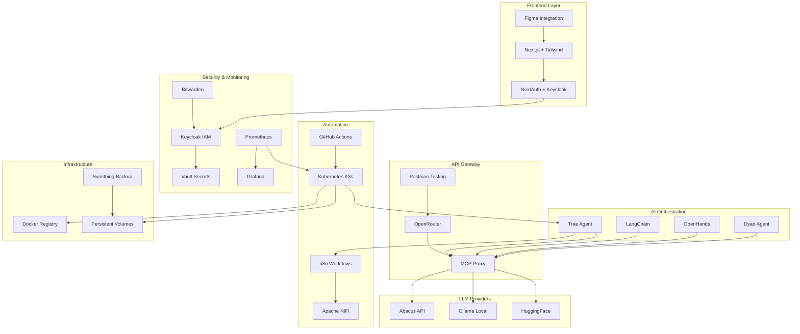

# 🚀 Full-Stack Industrial AI Development Environment

<p align="center">**Uma stack full-stack avançada, econômica e robusta para desenvolvimento, automação e deploy de aplicações baseadas em IA**</p>

<p align="center">
  <a href="#-visão-geral">Visão Geral</a> •
  <a href="#-arquitetura">Arquitetura</a> •
  <a href="#-começando">Começando</a> •
  <a href="#-operação">Operação</a> •
  <a href="#-configurações-avançadas">Avançado</a> •
  <a href="#-contribuição">Contribuição</a>
</p>

<p align="center">
  
  
  
  
  
  
  
  
</p>

## 🌟 Visão Geral

Esta é uma stack full-stack industrial para desenvolvimento de aplicações baseadas em IA, combinando máxima produtividade, automação avançada e segurança corporativa. O ambiente prioriza ferramentas open source e self-hosted, oferecendo controle total sobre a infraestrutura.

### Principais Funcionalidades

- 💻 **Terminal Moderno**: Warp CLI e Starship para alto throughput operacional
- 🤖 **Orquestração Multiagente**: Trae Agent, LangChain, Dyad e OpenHands
- 🧠 **Multi-LLM**: Abacus API (cloud), Ollama (local) e HuggingFace (open source)
- 🔄 **Automação**: n8n workflows, Apache NiFi e pipelines CI/CD
- 🛡️ **Segurança**: Keycloak (IAM), Vault (secrets) e Bitwarden (passwords)
- 📊 **Observabilidade**: Prometheus e Grafana com alertas em tempo real
- 🎨 **Frontend**: Next.js, Tailwind CSS e integração Figma
- 🐳 **Containerização**: Docker e Kubernetes com Helm charts

## 🏗️ Arquitetura

### Diagrama de Arquitetura


## 🚀 Começando
### Pré-requisitos

- Sistema Operacional: Linux (preferencial), macOS ou Windows via WSL
- Ferramentas Base: Docker, Git, Python 3.10+
- Conhecimentos: Conceitos de Kubernetes, linha de comando
- Acesso: Internet para downloads e APIs

### Instalação Rápida
```bash
# Instalar componentes essenciais
bash -c "$(curl -fsSL https://raw.githubusercontent.com/arturdrr/full-stack-industrial-ai/main/scripts/setup.sh)"
```
Para uma instalação manual detalhada, consulte nossa documentação de deployment.

### Configuração Inicial
```bash
# Configurar variáveis de ambiente
export ABACUS_API_KEY="sua-chave-aqui"
export OPENAI_API_KEY="sua-chave-aqui"
export GOOGLE_API_KEY="sua-chave-aqui" # Para Gemini
export ANTHROPIC_API_KEY="sua-chave-aqui" # Para Claude
export PERPLEXITY_API_KEY="sua-chave-aqui" # Para Perplexity
export HUGGINGFACE_API_KEY="sua-chave-aqui"

# Iniciar containers essenciais
docker-compose -f docker-compose.yml up -d
```
## 🛠️ Operação
### Agentes de IA
Os agentes podem ser configurados via arquivo YAML:
```yaml
agents:
  trae_agent:
    model: trae_agent_model
    max_steps: 200
  langchain_agent:
    model: langchain_model
    max_steps: 150
```
### Segurança
Keycloak e Vault formam a base de segurança:
```bash
# Iniciar Keycloak
./scripts/deploy-keycloak.sh

# Iniciar Vault
./scripts/deploy-vault.sh
```
### Monitoramento
Monitoramento com Prometheus e Grafana:

- Prometheus: http://localhost:9090
- Grafana: http://localhost:3000 (admin/admin)

## 💡 Configurações Avançadas
Consulte nossa documentação para configurações avançadas:

- Arquitetura Detalhada
- API e Integrações
- Perguntas Frequentes
- Roadmap

## 🔧 Manutenção
Atualize componentes regularmente:
```bash
# Atualizar Trae Agent
cd trae-agent
git pull origin main
pip install -r requirements.txt --upgrade

# Atualizar containers
docker-compose pull
docker-compose up -d
```
## 🤝 Contribuição
Contribuições são bem-vindas! Por favor, leia nosso guia de contribuição para mais detalhes sobre:

- Processo de fork e pull request
- Padrões de código
- Testes
- Documentação

## 📄 Licença
Este projeto está licenciado sob a Licença MIT - veja o arquivo LICENSE para detalhes.

## 📚 Links Úteis
### Documentação

- Trae Agent
- LangChain
- Keycloak
- Vault

### Ferramentas

- Next.js
- Kubernetes
- Prometheus
- Grafana


<p align="center"><strong>Desenvolvido com ❤️ para máxima produtividade em desenvolvimento de IA</strong></p>
<p align="center">📧 <strong>Contato</strong>: arturdr @gmail.com | 🐙 <strong>GitHub</strong>: @arturdrr</p>
