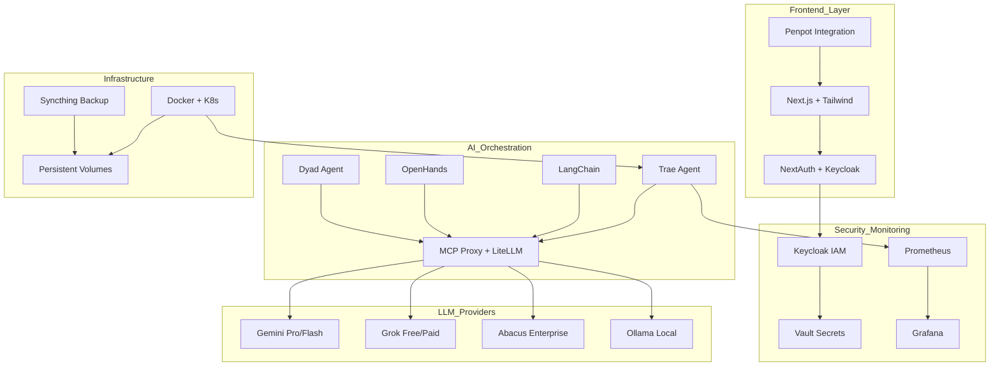

🚀 Full-Stack Industrial AI Development Environment
Uma stack full-stack avançada, econômica e robusta para desenvolvimento, automação e deploy de aplicações baseadas em IA com roteamento inteligente

Visão Geral - Arquitetura - Começando - Troubleshooting - Contribuição

🌟 Visão Geral
Esta stack full-stack industrial combina roteamento inteligente por IA, orquestração multi-LLM e automação avançada para desenvolvimento de aplicações IA de próxima geração. A arquitetura prioriza ferramentas open source, otimização de custos e segurança enterprise.

Principais Funcionalidades
🧠 Multi-LLM Inteligente: Gemini Pro (principal), Grok (gratuito), Abacus (enterprise), Ollama (local) com roteamento por IA

🔄 Roteamento Ultra-Inteligente: Classificação automática por IA + fallback multicamadas + otimização de custos

🎨 Frontend Moderno: Next.js 14+, Tailwind CSS e integração com Penpot (open source)

🤖 Orquestração Multiagente: Trae Agent, LangChain, OpenHands, Dyad com MCP protocol

🛡️ Segurança Enterprise: Keycloak (IAM) + Vault (secrets) + análise automática SonarQube CE

📊 Observabilidade: Prometheus + Grafana com alertas em tempo real e dashboards customizados

📚 RAG Avançado: LightRAG + ChromaDB/Qdrant para respostas contextuais precisas

🏗️ Arquitetura
Diagrama de Arquitetura

🚀 Começando
Pré-requisitos
Sistema: Linux (recomendado), macOS ou Windows via WSL

Ferramentas: Docker 20+, Git, Python 3.10+

Recursos: 8GB RAM, 4 CPU cores, 20GB storage

APIs: Pelo menos uma chave (Gemini, Grok, ou Abacus)

Instalação Rápida
```bash
# 1. Clonar repositório
git clone https://github.com/arturdrr/full-stack-industrial-ai.git
cd full-stack-industrial-ai

# 2. Configurar ambiente seguramente
cp .env.example .env.local
# ⚠️ IMPORTANTE: Edite .env.local com suas chaves reais

# 3. Executar setup automatizado
chmod +x scripts/setup.sh
./scripts/setup.sh

# 4. Verificar instalação
./scripts/health-check.sh
```
Configuração Manual
Se preferir instalação manual, consulte Guia de Deployment.

Serviços disponíveis após instalação:

🌐 Frontend: http://localhost:3000

🤖 AI Proxy: http://localhost:8081

🔐 Keycloak: http://localhost:8080

📊 Grafana: http://localhost:3000 (admin/admin)

🔍 Prometheus: http://localhost:9090

🔧 Troubleshooting
Problemas Comuns
❌ APIs não respondem:
```bash
# Testar conectividade
curl -X POST http://localhost:8081/health
./scripts/test-apis.sh
```
❌ Containers não iniciam:
```bash
# Verificar logs
docker-compose logs -f

# Resetar ambiente
docker-compose down -v && docker-compose up -d
```
❌ Roteamento não funciona:
```bash
# Verificar logs do proxy
docker logs litellm-proxy

# Reiniciar proxy
docker-compose restart litellm-proxy
```
Suporte
📧 Email: arturdr @gmail.com

🐙 Issues: GitHub Issues

📖 Docs: Documentação Completa

💡 Configurações Avançadas
📐 Arquitetura Detalhada

🔌 API e Integrações

❓ Perguntas Frequentes

🗺️ Roadmap

🚀 Deploy Production

🤝 Contribuição
Contribuições são muito bem-vindas! Veja CONTRIBUTING.md para:

Processo de fork e pull request

Padrões de código e commits

Testes e documentação

Code of conduct

📄 Licença
MIT License - veja LICENSE para detalhes.

Desenvolvido com ❤️ para máxima produtividade em desenvolvimento de IA

📧 Contato: arturdr @gmail.com | 🐙 GitHub: @arturdrr

<!-- Trigger CI/CD run -->
