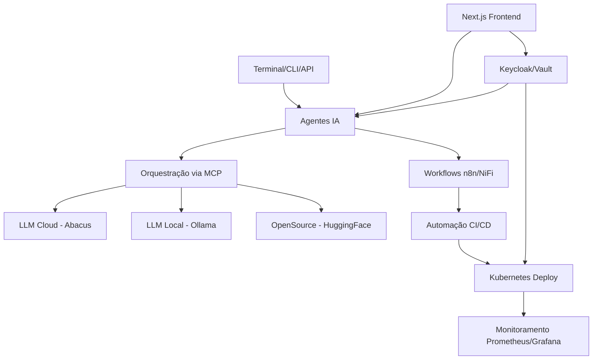

# 🏗️ Arquitetura da Stack Full-Stack Industrial AI

Este documento descreve as camadas, componentes e integrações que compõem a stack.

## 📚 Camadas

### 1. Terminal & Produtividade
- **Warp CLI + Starship**: Interface de linha de comando moderna com UX avançada e navegação eficiente
- **Zoxide**: Navegação inteligente entre diretórios

### 2. Agentes IA e Orquestração
- **Trae Agent**: Agente principal para automação de tarefas
- **LangChain**: Framework para composição de aplicações com LLMs
- **Dyad**: Agente conversacional avançado
- **OpenHands**: Orquestração multi-agente
- **MCPs**: Proxies para roteamento e gestão de contexto

### 3. Modelos e Infraestrutura IA
- **Abacus API**: Serviço cloud para modelos de IA de alta performance
- **Ollama**: Execução local de modelos para privacidade e controle de custos
- **HuggingFace**: Acesso a modelos open source

### 4. Automação e Orquestração de Workflows
- **n8n**: Plataforma low-code para automação de workflows
- **Apache NiFi**: Processamento e integração de dados
- **GitHub Actions**: CI/CD automatizado
- **Kubernetes**: Orquestração de containers

### 5. Segurança e Controle
- **Keycloak**: Gerenciamento de identidade e acesso (IAM)
- **Vault**: Gerenciamento seguro de segredos
- **Bitwarden**: Gerenciamento de senhas

### 6. Monitoramento
- **Prometheus**: Coleta de métricas em tempo real
- **Grafana**: Visualização de dados e alertas configuráveis

### 7. Frontend
- **Next.js**: Framework React para frontend
- **Tailwind CSS**: Framework CSS utilitário
- **Figma**: Design e prototipagem colaborativa

### 8. Ambiente Python
- **Poetry**: Gerenciamento de dependências e pacotes
- **Conda**: Ambientes para computação científica

### 9. Integração Pós-Deploy
- **OpenRouter**: Roteamento de APIs
- **Postman**: Testes e documentação de APIs
- **Toolify AI**: Ferramentas de discovery
- **GhostTrack**: Capacidades OSINT

## 🔄 Fluxo de Dados e Execução

1. Os agentes IA capturam demandas via terminal ou API REST
2. Pipelines de workflows são orquestrados via n8n e Apache NiFi
3. Respostas são computadas via LLM local ou cloud, gerenciadas via MCP
4. Segurança aplicada através de Keycloak e Vault
5. Monitoramento contínuo com Prometheus + Grafana
6. Deploys automatizados via CI/CD em Kubernetes com Helm charts

## 🔐 Segurança

A arquitetura implementa segurança em múltiplas camadas:

- **Autenticação**: Keycloak (OAuth2/OIDC)
- **Autorização**: RBAC no Kubernetes e aplicações
- **Secrets**: HashiCorp Vault para gerenciamento de segredos
- **Senhas**: Bitwarden self-hosted
- **Rede**: Acesso VPN e regras de firewall
- **Containers**: Imagens escaneadas por vulnerabilidades

## 📊 Observabilidade

O sistema mantém observabilidade completa através de:

- **Métricas**: Coletadas pelo Prometheus
- **Visualização**: Dashboards Grafana personalizados
- **Logs**: Agregação centralizada
- **Alertas**: Notificações configuráveis para eventos críticos
- **Traces**: Rastreamento de requisições entre componentes

## 🚀 Escalabilidade

A arquitetura foi projetada para escalar de forma eficiente:

- **Horizontal**: Adição de nós no cluster Kubernetes
- **Vertical**: Aumento de recursos por nó
- **Modelos**: Balanceamento entre cloud/local via MCP
- **Storage**: Volumes persistentes dimensionáveis

## 🔄 Integração e Extensibilidade

O sistema é altamente extensível através de:

- **APIs RESTful**: Integração com sistemas externos
- **Webhooks**: Comunicação event-driven
- **Workflows**: Processos customizáveis via n8n
- **Plugins**: Extensões para agentes e ferramentas