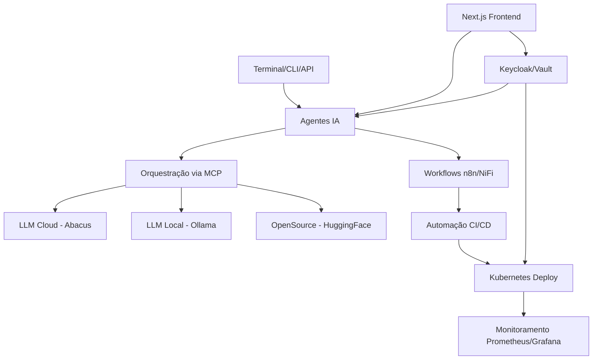

# 🏗️ Arquitetura da Stack Full-Stack Industrial AI

## Visão Geral

A Stack Full-Stack Industrial AI foi projetada como uma arquitetura modular, escalável e segura para desenvolvimento e implantação de aplicações baseadas em IA em ambientes corporativos. Esta arquitetura combina componentes de alta performance para orquestração de modelos de linguagem (LLMs), automação avançada, segurança empresarial e observabilidade completa, com foco na otimização de recursos e produtividade.

O design arquitetural segue princípios de microsserviços e integração contínua, permitindo evolução independente dos componentes e adaptabilidade a diferentes casos de uso industriais. A arquitetura prioriza:

- **Flexibilidade**: Combinação de modelos cloud e locais conforme necessidades específicas
- **Segurança**: Controles em múltiplas camadas com autenticação centralizada
- **Automação**: Processos automatizados desde o desenvolvimento até o deploy
- **Observabilidade**: Monitoramento abrangente de todos componentes

## 📚 Camadas

### 1. Terminal & Produtividade
- **Warp CLI + Starship**: Interface de linha de comando moderna com UX avançada e navegação eficiente
- **Zoxide**: Navegação inteligente entre diretórios

**Interações**: Esta camada fornece interface direta para desenvolvedores, integrando-se com sistemas de controle de versão e facilitando a operação dos agentes IA via linha de comando. Os comandos são processados localmente e encaminhados para a camada de agentes.

### 2. Agentes IA e Orquestração
- **Trae Agent**: Agente principal para automação de tarefas, capaz de executar operações complexas através de ferramentas definidas
- **LangChain**: Framework para composição de aplicações com LLMs, integrando-se com diversos providers, incluindo **LangChain CLI** para interações via linha de comando.
- **Dyad**: Agente conversacional avançado otimizado para diálogos complexos e multi-turn
- **OpenHands**: Orquestração multi-agente com capacidade para distribuição de tarefas
- **AutoGen CLI**: Ferramenta para habilitar conversas multi-agentes e automação de tarefas complexas.
- **MCPs**: Proxies para roteamento, balanceamento e gestão de contexto entre diferentes provedores de LLM, com o **LiteLLM Proxy CLI** fornecendo uma interface de linha de comando para gerenciamento de LLMs.

**Interações**: Os agentes comunicam-se entre si via barramento de mensagens em formato JSON estruturado. O MCP atua como camada de abstração, direcionando requisições para os modelos apropriados com base em critérios como latência, custo e capacidades.

### 3. Modelos e Infraestrutura IA
- **Abacus API**: Serviço cloud para modelos de IA de alta performance, oferecendo modelos de vários tamanhos
- **Ollama**: Execução local de modelos para privacidade e controle de custos, com suporte a modelos quantizados
- **HuggingFace**: Acesso a modelos open source com diversidade de capacidades específicas
- **FAISS ou Pinecone**: Bancos de dados vetoriais para Retrieval-Augmented Generation (RAG), permitindo buscar informações relevantes para LLMs.
- **LightRAG**: Ferramenta otimizada para a construção de sistemas RAG leves e eficientes, garantindo respostas contextuais.

**Interações**: Comunicação via API REST padronizada, com sistema de fallback automático entre provedores. Os modelos são invocados pelos agentes através do MCP, que gerencia o contexto da conversa e aplica políticas de rate-limiting e retry. Sistemas RAG, como FAISS/Pinecone e LightRAG, são utilizados para enriquecer as consultas aos LLMs.

### 4. Automação e Orquestração de Workflows
- **n8n**: Plataforma low-code para automação de workflows, permitindo integração com mais de 200 serviços
- **Apache NiFi**: Processamento e integração de dados para pipelines complexos com alta escala
- **GitHub Actions**: CI/CD automatizado para testes, builds e deploy
- **Kubernetes**: Orquestração de containers para escalonamento e gerenciamento de aplicações

**Interações**: Os workflows n8n podem ser disparados por eventos ou programados, processando dados que são então encaminhados para os agentes IA. Os resultados podem alimentar pipelines CI/CD que implementam mudanças na infraestrutura via Kubernetes.

### 5. Segurança e Controle
- **Keycloak**: Gerenciamento de identidade e acesso (IAM) centralizado com suporte a OIDC/SAML
- **Vault**: Gerenciamento seguro de segredos, permitindo rotação automática de credenciais
- **Bitwarden**: Gerenciamento de senhas self-hosted para controle total dos dados
- **Snyk Code AI CLI**: Ferramenta de linha de comando para análise de segurança de código assistida por IA, identificando vulnerabilidades em tempo real.
- **Syncthing**: Ferramenta de sincronização de arquivos ponto a ponto, usada para backups distribuídos e sincronização de dados sensíveis entre componentes.

**Interações**: Todos os componentes se autenticam via Keycloak, que emite tokens JWT. O Vault fornece credenciais dinâmicas para acesso a bancos de dados e APIs externas, integrado com o Kubernetes via injector de secrets. Snyk Code AI CLI é integrado ao pipeline de CI/CD para varredura de vulnerabilidades, enquanto Syncthing garante a resiliência e disponibilidade de dados críticos.

### 6. Monitoramento
- **Prometheus**: Coleta de métricas em tempo real com alta disponibilidade
- **Grafana**: Visualização de dados e alertas configuráveis via dashboards interativos

**Interações**: Cada componente expõe métricas via endpoint /metrics que são coletadas pelo Prometheus. Alertas críticos podem disparar webhooks para notificação em canais como Slack ou email.

### 7. Frontend
- **Next.js**: Framework React para frontend com SSR/SSG para performance otimizada
- **Tailwind CSS**: Framework CSS utilitário para desenvolvimento ágil de interfaces
- **Figma**: Design e prototipagem colaborativa integrada ao workflow de desenvolvimento

**Interações**: O frontend comunica-se com o backend via API RESTful, autenticando-se através do Keycloak. Componentes React reutilizáveis seguem a biblioteca de design definida no Figma.

### 8. Ambiente Python
- **Poetry**: Gerenciamento de dependências e pacotes com resolução determinística
- **Conda**: Ambientes para computação científica com bibliotecas nativas otimizadas
- **spaCy**: Biblioteca avançada para Processamento de Linguagem Natural (NLP), usada para tarefas como tokenização, reconhecimento de entidades e análise sintática.
- **Lark**: Ferramenta de análise sintática (parser) versátil, útil para criar gramáticas e processar dados textuais estruturados.

**Interações**: Poetry gerencia as dependências dos agentes IA, enquanto Conda é utilizado para ambientes específicos de ciência de dados e computação intensiva. spaCy e Lark são integrados aos agentes para capacidades avançadas de NLP e interpretação de comandos ou dados textuais.

### 9. Integração Pós-Deploy
- **OpenRouter**: Roteamento de APIs com cache e rate-limiting
- **Postman**: Testes e documentação de APIs com collection compartilhadas
- **Toolify AI**: Ferramentas de discovery para análise e otimização
- **GhostTrack**: Capacidades OSINT para validação de dados externos

**Interações**: APIs externas são acessadas via OpenRouter, que centraliza o controle de acesso e limites. Postman é utilizado tanto para testes automatizados quanto para exploração manual de endpoints.

## 🔄 Fluxo de Dados e Execução

Os agentes IA capturam demandas via terminal ou API REST
Pipelines de workflows são orquestrados via n8n e Apache NiFi
Respostas são computadas via LLM local ou cloud, gerenciadas via MCP
Segurança aplicada através de Keycloak e Vault
Monitoramento contínuo com Prometheus + Grafana
Deploys automatizados via CI/CD em Kubernetes com Helm charts

## 🔐 Segurança

A arquitetura implementa segurança em múltiplas camadas:

- **Autenticação**: Keycloak (OAuth2/OIDC) com suporte a MFA e SSO
- **Autorização**: RBAC no Kubernetes e aplicações com políticas granulares
- **Secrets**: HashiCorp Vault para gerenciamento de segredos com rotação automática
- **Senhas**: Bitwarden self-hosted para controle completo do ciclo de vida de credenciais
- **Rede**: Acesso VPN e regras de firewall com micro-segmentação
- **Containers**: Imagens escaneadas por vulnerabilidades via Trivy e Clair

## 📊 Observabilidade

O sistema mantém observabilidade completa através de:

- **Métricas**: Coletadas pelo Prometheus com resolução customizável
- **Visualização**: Dashboards Grafana personalizados para diferentes stakeholders
- **Logs**: Agregação centralizada com Loki ou ELK stack
- **Alertas**: Notificações configuráveis para eventos críticos com políticas de escalonamento
- **Traces**: Rastreamento de requisições entre componentes via OpenTelemetry

## 🚀 Escalabilidade

A arquitetura foi projetada para escalar de forma eficiente:

- **Horizontal**: Adição de nós no cluster Kubernetes com auto-scaling baseado em métricas
- **Vertical**: Aumento de recursos por nó conforme demanda, com suporte a GPU/TPU
- **Modelos**: Balanceamento entre cloud/local via MCP, com cache para redução de latência
- **Storage**: Volumes persistentes dimensionáveis com classes de armazenamento por caso de uso

## 🔄 Integração e Extensibilidade

O sistema é altamente extensível através de:

- **APIs RESTful**: Integração com sistemas externos via padrões OpenAPI
- **Webhooks**: Comunicação event-driven para integrações loosely-coupled
- **Workflows**: Processos customizáveis via n8n com suporte a scripts personalizados
- **Plugins**: Extensões para agentes e ferramentas via sistema de módulos carregáveis dinamicamente

## ⚡ Requisitos de Performance

A arquitetura foi dimensionada considerando os seguintes requisitos não-funcionais:

- **Latência**: Respostas de agentes IA em <2 segundos para consultas padrão
- **Throughput**: Suporte a 100+ requisições simultâneas em cluster com 3 nós
- **Disponibilidade**: SLA de 99.9% (downtime máximo de 8.7 horas/ano)
- **RTO/RPO**: Recovery Time Objective de 15 minutos, Recovery Point Objective de 5 minutos
- **Capacidade**: Escalabilidade para até 1000 usuários concorrentes com degradação aceitável
- **Consumo de recursos**: Otimizado para máquinas com 8 vCPUs e 16GB RAM mínimo

## 🛠️ Considerações de Implementação

Ao implementar esta arquitetura, considere:
### Fase Inicial

- Comece com deployment local de Ollama antes de escalar para cloud
- Implemente primeiramente autenticação e monitoramento básico
- Utilize Kubernetes single-node (K3s) para ambientes de desenvolvimento

### Escalando

- Separe namespaces Kubernetes por ambiente (dev, staging, prod)
- Implemente CI/CD gradualmente, começando com testes e depois automação completa
- Configure backups e processos de disaster recovery antes de ir para produção

### Desafios Comuns

- Cold Start: LLMs locais podem ter latência inicial alta - implemente preloading
- Token Management: Monitore consumo de tokens de API para evitar custos inesperados
- Rate Limiting: Implemente filas e backoff exponencial para lidar com limitações de API
- Versioning: Mantenha compatibilidade entre agentes IA e modelos com semantic versioning

### Trade-offs

- Local vs Cloud: Modelos locais oferecem privacidade mas têm capacidades limitadas
- Concorrência vs Latência: Aumentar concorrência pode impactar latência - configure limites
- Cache vs Freshness: Caching reduz latência mas pode resultar em dados desatualizados

## 🔮 Requisitos Não-Funcionais e Considerações Futuras

### Requisitos Não-Funcionais

- **Disponibilidade**: Alta disponibilidade através de arquitetura redundante, balanceamento de carga e estratégias de failover em Kubernetes.
- **Confiabilidade**: Mecanismos de retry, circuit breaker e filas de mensagens para garantir a entrega e o processamento de dados mesmo sob condições adversas.
- **Manutenibilidade**: Código modular, documentação clara e automação de CI/CD para facilitar a manutenção e evolução do sistema.
- **Segurança**: Implementação de defesa em profundidade, incluindo segurança de rede, criptografia de dados em trânsito e em repouso, gerenciamento de vulnerabilidades e hardening de sistemas.
- **Auditoria**: Capacidade de registrar todas as ações e eventos críticos para conformidade e análise forense.

### Limitações e Considerações Futuras

- **Custos de LLM**: A dependência de modelos de IA em nuvem pode gerar custos elevados. A otimização via Ollama e OpenRouter é crucial.
- **Complexidade de Gerenciamento**: A diversidade de ferramentas e tecnologias exige uma equipe com expertise multifacetada.
- **Evolução dos Modelos de IA**: A arquitetura deve ser flexível para integrar rapidamente novos modelos e técnicas de IA.
- **Edge Computing**: Exploração futura de capacidades de edge computing para processamento de dados ainda mais próximo da fonte em ambientes industriais, reduzindo latência e dependência de conectividade.
- **Soberania de Dados**: Para certas indústrias, pode ser necessário garantir que todos os dados permaneçam on-premises, o que exigiria a completa "desacoplagem" de serviços em nuvem.
- **Monitoramento Preditivo**: Implementação de análises preditivas sobre os dados de monitoramento para identificar e resolver problemas antes que afetem o serviço.
